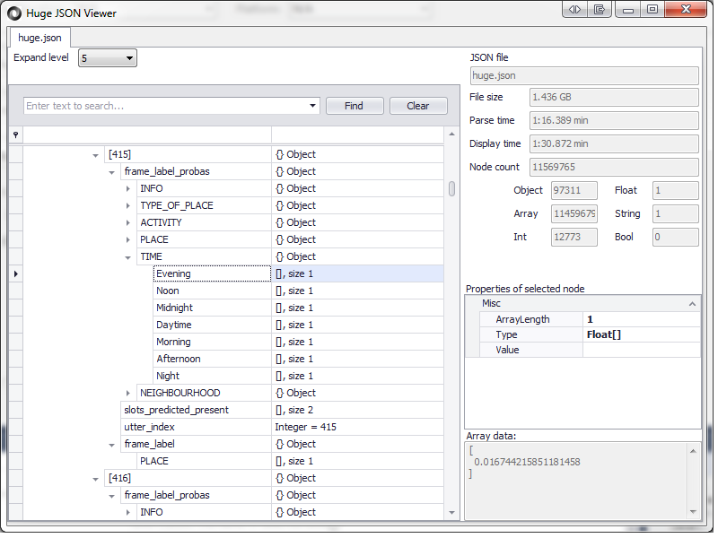
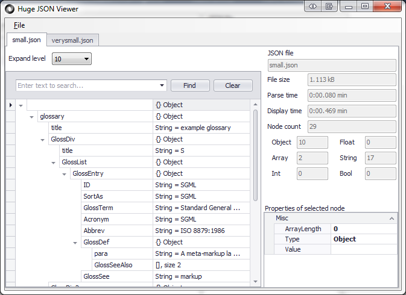

# HugeJsonViewer
Viewer for JSON files that can be GBs large.

Inspired by a [Question on Software Recommendations](http://softwarerecs.stackexchange.com/questions/18839/json-viewer-for-windows), I wrote this viewer for very large JSON files. It can open files of 1.4 GB in size or even larger, as long as you have ~7 times the amount of RAM on your machine.

## System requirements
* Windows 7 SP1 or higher
* .NET 4.5
* 64 bit recommended (unless you open "small" files with less than 300 MB)

## Releases

[Huge JSON Viewer 0.4.12.19 Setup.exe.zip](http://wellisolutions.de/downloads/Huge-JSON-Viewer-0.4.12.19-Setup.exe_.zip) (13.8 MB)

[Huge JSON Viewer 0.4.12.19 Portable.zip](http://wellisolutions.de/downloads/Huge-JSON-Viewer-0.4.12.19-Portable.zip) (17.4 MB)

## Screenshots

UI with tabs and filtering capability:

