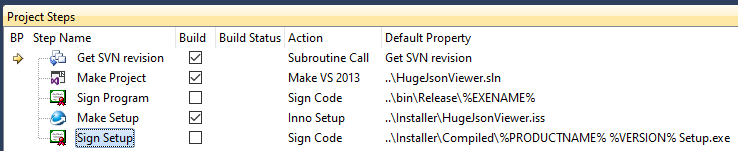

# HugeJsonViewer
Viewer for JSON files that can be GBs large.

Inspired by a [Question on Software Recommendations](http://softwarerecs.stackexchange.com/questions/18839/json-viewer-for-windows), I wrote this viewer for very large JSON files. It can open files of 1.4 GB in size or even larger, as long as you have ~7 times the amount of RAM on your machine.

## System requirements
* Windows 7 SP1 or higher
* .NET 4.5
* 64 bit recommended (unless you open "small" files with less than 300 MB)

## Releases

These will be the last releases which are code-signed and time-stamped. My code signing certificate is expired and I don't want to buy a new one.

[Huge JSON Viewer 0.4.12.19 Setup.exe.zip](https://wellisolutions.de/downloads/Huge-JSON-Viewer-0.4.12.19-Setup.exe_.zip) (13.8 MB)

[Huge JSON Viewer 0.4.12.19 Portable.zip](https://wellisolutions.de/downloads/Huge-JSON-Viewer-0.4.12.19-Portable.zip) (17.4 MB)

## How to build

In order to build the project, you need DevExpress as the UI toolkit. The license file mentions `XtraVerticalGrid` and `XtraTreeList`.

The original version was built using [VisualBuild](https://www.kinook.com/VisBuildPro/). In case you don't have Visual Build, here's a screenshot of what it does:

## Screenshots

UI with tabs and filtering capability:

